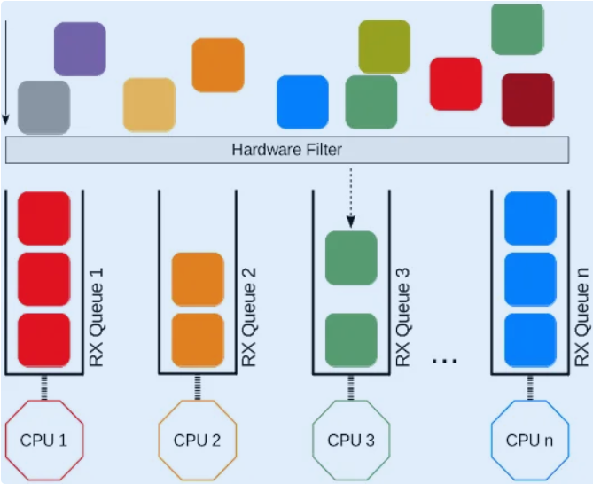
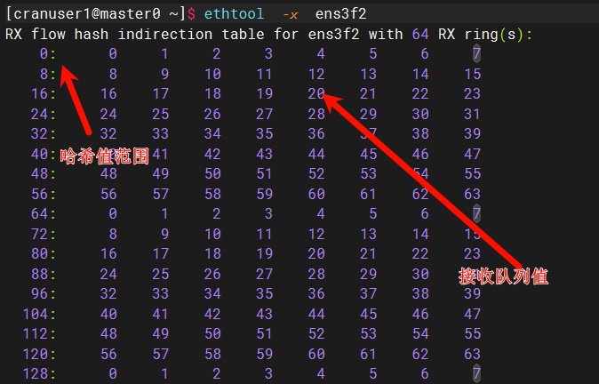
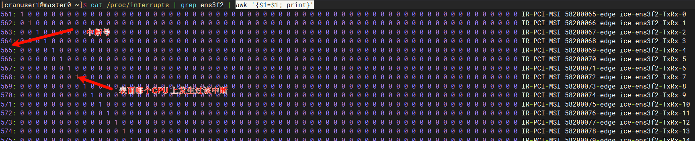

# RSS 

## 查看网卡是否启用RSS
### 1. 查看当前 RSS 队列数量和配置
ip link show          # 获取网卡名
ethtool -l 网卡名     # 查看可用队列数
ethtool -x 网卡名     # 查看当前 RSS 配置和哈希表

### 2. 设置队列数量（通常设置为 CPU 核心数）
ethtool -L 网卡名 rx 队列数量 tx 队列数量
ethtool -L ens3f2 rx 64 tx 64

### 3. 设置中断亲和性（将不同队列绑定到不同 CPU）
#### 首先查看网卡中断
cat /proc/interrupts | grep 网卡名

#### 设置中断亲和性
echo "cpu掩码" > /proc/irq/中断号/smp_affinity
e.g. 
> echo 1 > /proc/irq/64/smp_affinity  # 绑定到CPU0到IRQ 64

### 4. 调整 RSS 哈希配置
ethtool -X 网卡名 equal 队列数    # 平均分配
#### 或
ethtool -X 网卡名 weight 权重列表  # 按权重分配