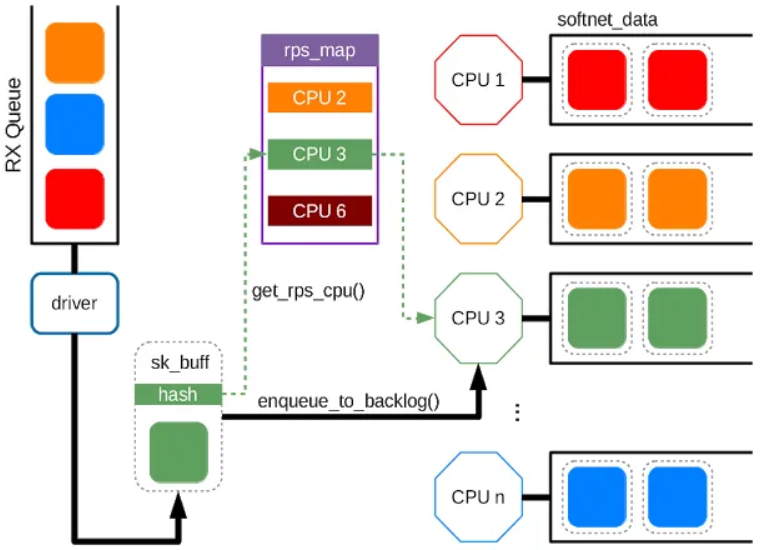
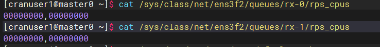
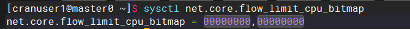

# RPS: Receive Packet Steering
在接收中断处理程序的下半部分会调用RPS(当一个驱动使用[napi_gro_receive()](https://github.com/torvalds/linux/blob/7af08b57bcb9ebf78675c50069c54125c0a8b795/net/core/gro.c#L626)(netif_receive_skb())发送一个报文到网络栈时)。这些函数会调用[get_rps_cpu()](https://github.com/torvalds/linux/blob/7af08b57bcb9ebf78675c50069c54125c0a8b795/net/core/dev.c#L4606) 函数，get_rps_cpu() 会选择一个处理报文的队列。

## 查看CPU配置

在驱动将报文封装到sk_buff之后，将会经过 netif_rx_internal() 或 netif_receive_skb_internal()，然后调用get_rps_cpu()将哈希值映射到rps_map中的某个表项，即`CPU id`。在获取到CPU id之后，enqueue_to_backlog()会将sk_buff 放到指定的CPU队列中(后续处理)。为每个CPU分配的队列是一个per-cpu变量，softnet_data。

## RPS流限制
只有当RPS或RFS目标CPU达到饱和时，才会激活此功能。一旦一个CPU的输入报文队列超过最大队列长度(即，`net.core.netdev_max_backlog`)的一半，内核会从最近的256个报文开始按流计数，如果接收到一个新的报文，且此时这条流的报文数超过了设置的比率(默认为一半，即超过了256/2个)，则会丢弃新报文。其他流的报文只有在输入报文队列达到netdev_max_backlog时才会丢弃报文。如果报文队列长度低于阈值，则不会丢弃报文，因此流量限制不会完全切断连接：即使是大流量也可以保持连接。

## 实际不启用
RPS/RFS主要是针对单队列网卡多CPU环境。而/proc/irq/{IRQ}/smp_affinity和/proc/irq/{IRQ}/smp_affinity_list指定了哪些CPU能够关联到一个给定的IRQ源。RPS只是单纯把数据包均衡到不同的cpu，这个时候如果应用程序所在的cpu和软中断处理的cpu不是同一个，此时对cpu cache的影响会很大。目前大多数SMP系统会使用smp_affinity功能，默认不启用RPS。
